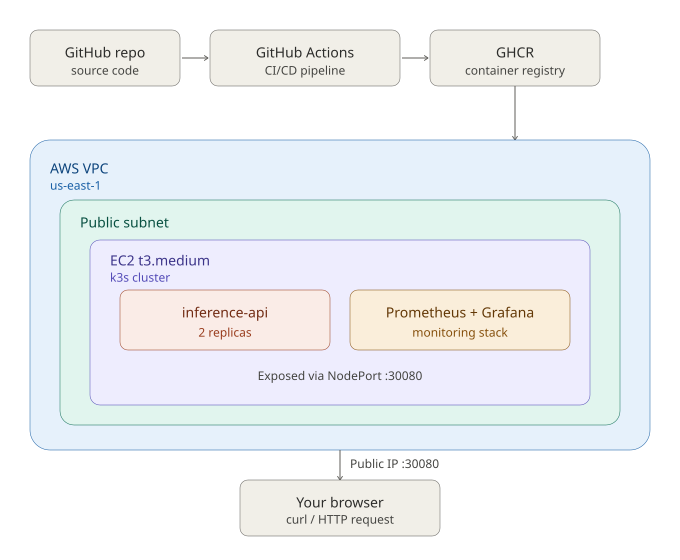

# Self-Hosted Inference Platform — Infrastructure Portfolio Project

A single-node Kubernetes (k3s) platform on AWS, provisioned entirely with
Terraform, deploying a containerized inference API through a GitHub Actions
CI/CD pipeline, with CloudWatch-based monitoring and alerting.

Built to run entirely inside the AWS Free Tier (t3.micro / t2.micro, no NAT
Gateway, no managed EKS control plane cost).

## Why this exists

This repo is a deliberately end-to-end demonstration of the infra engineer /
SRE workflow: provision → deploy → observe → iterate — rather than a single
isolated Terraform module. Every design decision is written down in
[`docs/adr/`](docs/adr) so the reasoning is visible, not just the code.

## Architecture



## Repo layout

```
terraform/     - all infrastructure as code (VPC, EC2, security groups, IAM)
app/           - the containerized workload (FastAPI placeholder inference API)
k8s/           - Kubernetes manifests deployed onto the k3s node
.github/       - CI/CD pipeline (GitHub Actions)
monitoring/    - CloudWatch alarm definitions (as Terraform)
docs/adr/      - Architecture Decision Records — the "why" behind each choice
```

## How the pieces connect

1. `terraform apply` stands up a VPC, a single EC2 instance, and installs k3s
   via user-data on first boot.
2. GitHub Actions builds the `app/` container, pushes it to a registry, and
   applies the manifests in `k8s/` against the cluster over SSH/kubeconfig.
3. CloudWatch alarms in `monitoring/` watch instance health and app-level
   metrics and would page/alert in a real deployment.

## Cost control

Everything here is sized to stay inside AWS Free Tier limits:
- Single `t3.micro` EC2 instance (no managed EKS control plane, no NAT Gateway)
- No Elastic IP left unattached (would incur charges)
- CloudWatch free tier alarms only (no custom high-resolution metrics)

**Remember to `terraform destroy` when you're done demoing it.**

## Running it yourself

```bash
cd terraform
terraform init
terraform plan
terraform apply
```

See [`Makefile`](Makefile) for the full local dev workflow.
